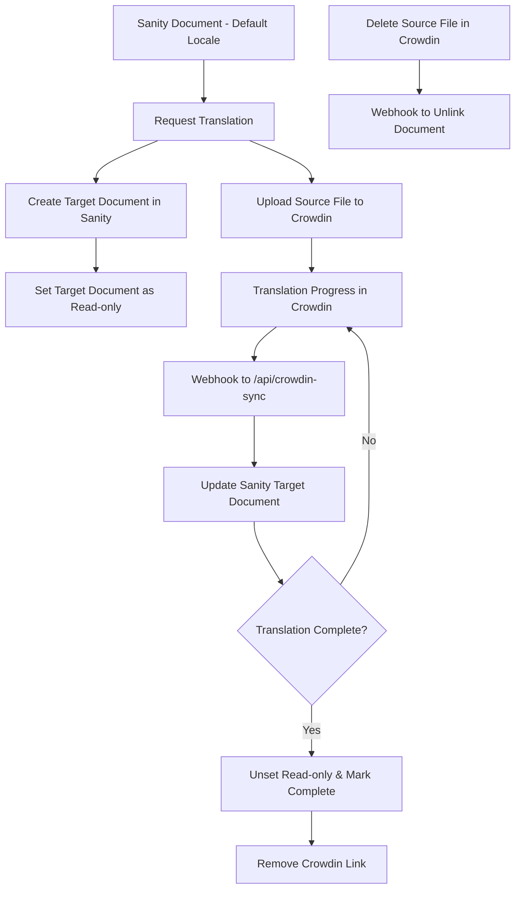

# Sanity x Crowdin Plugin

A comprehensive integration between Sanity CMS and Crowdin translation platform that enables seamless document-level translations with real-time synchronization.

## Overview

This repository demonstrates how to integrate Sanity CMS with Crowdin for automated translation workflows. The plugin provides:

- **Sanity Plugin**: Injects a Crowdin translation dashboard into Sanity documents that require translation
- **Backend Handler**: Processes Crowdin webhooks and manages translation synchronization
- **Document-level Translation**: Works with Sanity's official `@sanity/document-internationalization` plugin
- **Real-time Sync**: Automatic updates when translations progress in Crowdin

## Architecture



## Prerequisites

- **Sanity Project**: A configured Sanity project with the `@sanity/document-internationalization` plugin
- **Crowdin Account**: A Crowdin account with API access
- **Next.js Application**: A Next.js app with API routes support
- **Environment Variables**: Proper configuration for both Sanity and Crowdin

## Installation & Setup

### 1. Configure Crowdin Account

1. **Create a Crowdin Project**:
   - Log into your Crowdin account
   - Create a new project or use an existing one
   - Note your Project ID (found in project settings)

2. **Generate API Token**:
   - Go to your Crowdin profile settings
   - Navigate to "Tools" and "API"
   - Generate a new Personal Access Token
   - Save the token securely in your .env file

3. **Configure Webhooks**:
   - In your Crowdin project settings, go to "Tools" and "Webhooks"
   - Add a new webhook with the following settings:
     - **URL**: `https://your-domain.com/api/crowdin-sync` (or use ngrok for local development)
     - **Events**: Select the following events:
       - `translation.updated` - Exported translation updated
       - `file.approved` - File fully reviewed  
       - `file.deleted` - File deleted
     - **HTTP Method**: POST
     - **Content Type**: application/json

   **Local Development**: For testing webhooks locally, you can use [ngrok](https://ngrok.com/) to create a public URL for your local development server:
   ```bash
   # Install ngrok
   npm install -g ngrok
   
   # Start your Next.js app on port 3000
   npm run dev
   
   # In another terminal, expose your local server
   ngrok http 3000
   ```
   
   Then use the ngrok URL (e.g., `https://abc123.ngrok.io/api/crowdin-sync`) as your webhook URL in Crowdin for local testing.

### 2. Environment Configuration

Create or update your `.env` file:

```env
# Sanity Configuration
NEXT_PUBLIC_SANITY_PROJECT_ID=your-sanity-project-id
NEXT_PUBLIC_SANITY_DATASET=production
NEXT_PUBLIC_SANITY_API_VERSION=2023-06-21
SANITY_API_TOKEN=your-sanity-write-token

# Crowdin Configuration
CROWDIN_PROJECT_ID=your-crowdin-project-id
CROWDIN_ACCESS_TOKEN=your-crowdin-access-token
NEXT_PUBLIC_CROWDIN_API_ENDPOINT=https://{{your-domain.com}}/api/crowdin-sync
# The Crowdin organization is optional
CROWDIN_ORGANIZATION=your-organization-name
```

### 3. Configure Translation Exclusions

Update `sanity/fieldsToExcludeFromTranslation.ts` to exclude Sanity-specific fields from translation:

```typescript
export const fieldsToExcludeFromTranslation = {
  strings: ['locale', '_id', '_type', '_rev'],
  objects: ['pathname', 'slug'],
} as const;
```

### 4. Update i18n Configuration

Modify `config.ts` to include your supported locales:

```typescript
const config = {
  // ... other config
  i18n: {
    defaultLocaleId: "en",
    locales: [
      {id: "en", title: "English"},
      {id: "fr", title: "French"},
      {id: "es", title: "Spanish"},
      // Add more locales as needed
    ],
  },
  // ... rest of config
};
```

### 5. Configure Sanity Plugin

Update your `sanity.config.ts` to include the Crowdin plugin:

```typescript
import { crowdinPlugin } from "./sanity/plugins/crowdin-sanity";
import { supportedTargetLangs, i18nAdapter } from "./sanity/crowdinConfig";
import defineCrowdinOptions from "./sanity/plugins/crowdin-sanity/defineCrowdinPlugin";
import { injectCrowdinIntoSchema } from "./sanity/plugins/crowdin-sanity/injectCrowdinIntoSchema";

const CROWDIN_CONFIG = defineCrowdinOptions({
  sourceLang: config.i18n.defaultLocaleId,
  supportedTargetLangs,
  translatableTypes: ['modular.page', 'home'], // Add your document types
  apiEndpoint: process.env.NEXT_PUBLIC_CROWDIN_API_ENDPOINT || "http://localhost:3000/api/crowdin-sync",
  i18nAdapter,
});

export default defineConfig({
  // ... other config
  plugins: [
    // ... other plugins
    crowdinPlugin(CROWDIN_CONFIG),
  ],
  schema: {
    types: injectCrowdinIntoSchema(schemas, CROWDIN_CONFIG),
  },
});
```

### 6. Set Up API Route

Ensure your `app/api/crowdin-sync/route.ts` is properly configured:

```typescript
import { createInternalHandler } from "@/sanity/plugins/crowdin-sanity/backendHandler";
import { createClient } from "@sanity/client";

const crowdinHandler = createInternalHandler({
  crowdinCredentials: {
    accessToken: process.env.CROWDIN_ACCESS_TOKEN || "",
    projectId: parseInt(process.env.CROWDIN_PROJECT_ID || "0"),
    organization: process.env.CROWDIN_ORGANIZATION || "",
  },
  sanityClient: client.withConfig({ token: process.env.SANITY_API_TOKEN }),
  i18nAdapter,
  supportedTargetLangs,
});

export const POST = async (request: Request) => {
  const body = await request.json();
  const crowdinRes = await crowdinHandler({ body, requestUrl: request.url });
  
  if (!crowdinRes) {
    return new Response("Syncing failed", { status: 500 });
  }

  return new Response(JSON.stringify(crowdinRes.body), {
    status: crowdinRes.status,
    headers: {
      "Access-Control-Allow-Origin": "*",
      "Access-Control-Allow-Methods": "GET, POST, OPTIONS",
      "Access-Control-Allow-Headers": "Content-Type, Authorization",
    },
  });
};
```

## Usage

### Requesting Translations

1. **Open a Document**: Navigate to any document with the default locale in your Sanity Studio
   
2. **Translation Dashboard**: You'll see a new "Crowdin Translation" section in the document
    

3. **Select Target Languages**: Choose which languages to translate the document into
    

4. **Initiate Translation**: Click "Send to Crowdin" to upload the document to Crowdin

### Translation Workflow

1. **Source Upload**: The document is uploaded to Crowdin as an HTML file
2. **Target Creation**: A read-only target document is created in Sanity
3. **Translation Progress**: As translators work in Crowdin, webhooks update the Sanity document
4. **Completion**: When translation is complete, the target document becomes editable

### Monitoring Progress

- **Crowdin Dashboard**: Monitor translation progress directly in Crowdin
- **Sanity Studio**: View translation status in the document's Crowdin dashboard
- **Webhook Logs**: Check your API route logs for synchronization status

## Optional: Crowdin Preview Integration

### Benefits

- **Live Preview**: See how translations look from the Crowdin translation editor
- **Better Quality**: Translators can see the actual page preview
- **Faster Review**: Reduce back-and-forth between translators and developers

### Install Embed File Context App

1. **Install the App**: Go to [Crowdin Store - Embed File Context](https://store.crowdin.com/file-context-embed)
2. **Configure in Project**: Add the app to your Crowdin project
3. **Configure Vercel Headers**: Add the following configuration to your `vercel.json` to allow Crowdin to embed your preview pages:

```json
{
  "github": { "silent": true },
  "headers": [
    {
      "source": "/(.*)",
      "headers": [
        {
          "key": "X-Content-Type-Options",
          "value": "nosniff"
        },
        {
          "key": "X-Frame-Options",
          "value": "ALLOW-FROM *.crowdin.com *.crowdin.net"
        },
        {
          "key": "Content-Security-Policy",
          "value": "frame-ancestors 'self' *.crowdin.net *.crowdin.com;"
        },
        {
          "key": "Strict-Transport-Security",
          "value": "max-age=15552000; includeSubdomains"
        }
      ]
    }
  ]
}
```

**Important**: These headers are required for the Crowdin Embed File Context app to work properly. Without them, Crowdin won't be able to load your preview pages in iframes.

4. **Custom Script**: Add the following script to the Embed File Context app settings:

```javascript
(function () {
  const parseUrlsAndLanguageCodes = (input) => {
    const regex = /Preview link - ([A-Z\-]+)\n\n(http[^\s]+)/g;
    let match;
    const result = [];

    while ((match = regex.exec(input)) !== null) {
      const languageCode = match[1];
      const url = match[2];
      result.push({ languageCode, url });
    }

    return result;
  };

  const targetLang = env.context.editor.target_language_id;

  const parsedData = parseUrlsAndLanguageCodes(env.file.context);
  if (parsedData?.length) {
    return parsedData.find(l => l.languageCode.toLowerCase() == targetLang).url;
  } else {
    return null;
  }
})();
```


## Troubleshooting

### Common Issues

1. **Webhook Failures**:
   - Check your API route is accessible
   - Verify CORS settings
   - Ensure environment variables are correct

2. **Translation Not Starting**:
   - Verify document has default locale
   - Check translatable types configuration
   - Ensure Crowdin credentials are valid

3. **Sync Issues**:
   - Check Sanity API token permissions
   - Verify webhook URL is correct
   - Review API route logs

## API Reference

### Plugin Configuration

```typescript
interface CrowdinPluginOptions {
  sourceLang: string;
  supportedTargetLangs: readonly string[];
  translatableTypes: readonly string[];
  apiEndpoint: string;
  i18nAdapter: I18nAdapter;
}
```

### Webhook Events

The plugin handles the following Crowdin webhook events:
- `translation.updated` - Exported transaltion updated - When a file translation is updated
- `file.approved` - File fully reviewed - When a file is fully approved
- `file.deleted` - File deleted - When source file is deleted

## License

This project is licensed under the MIT License.

---

**Note**: This plugin requires both Sanity and Crowdin accounts with proper API access. Ensure you have the necessary permissions and API tokens before installation.
